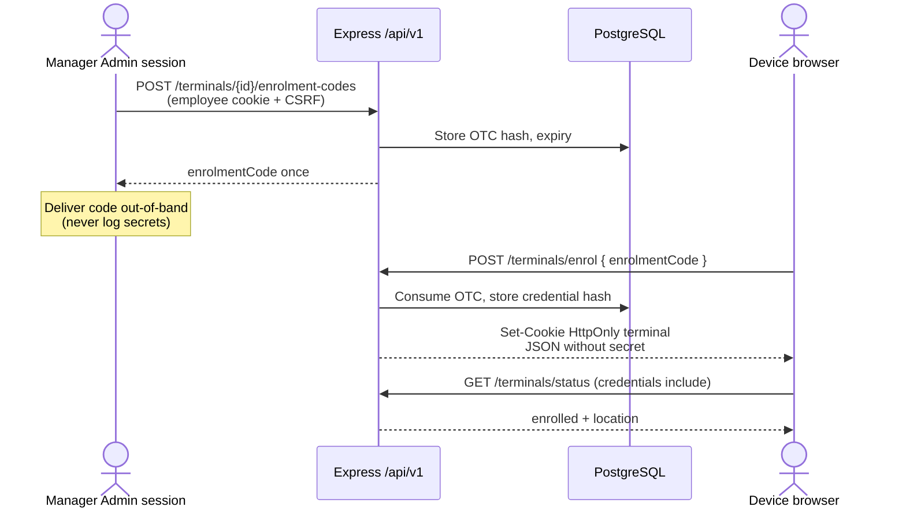
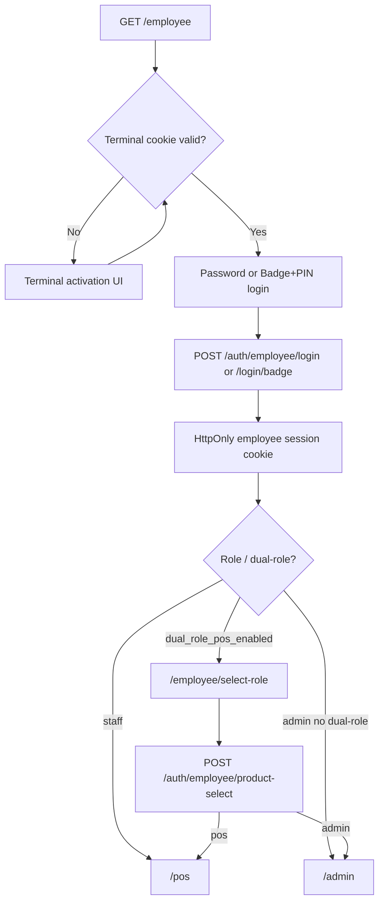
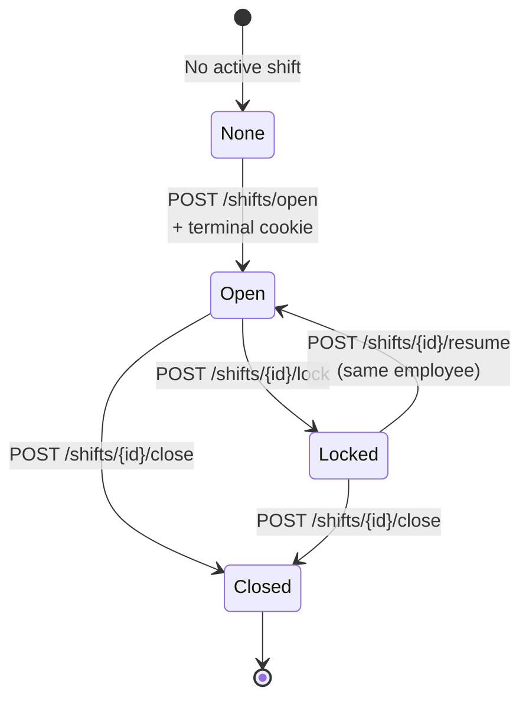
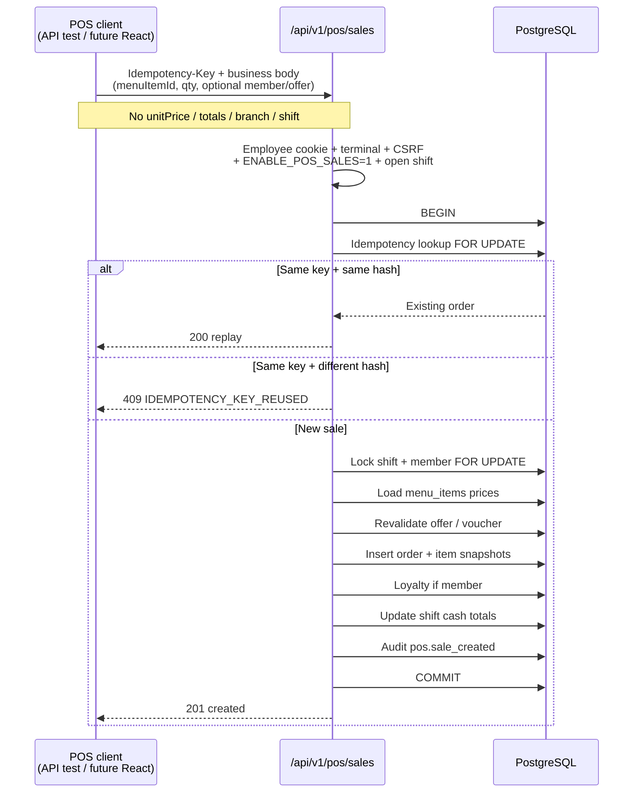
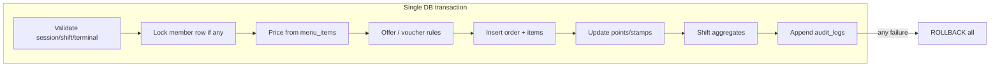
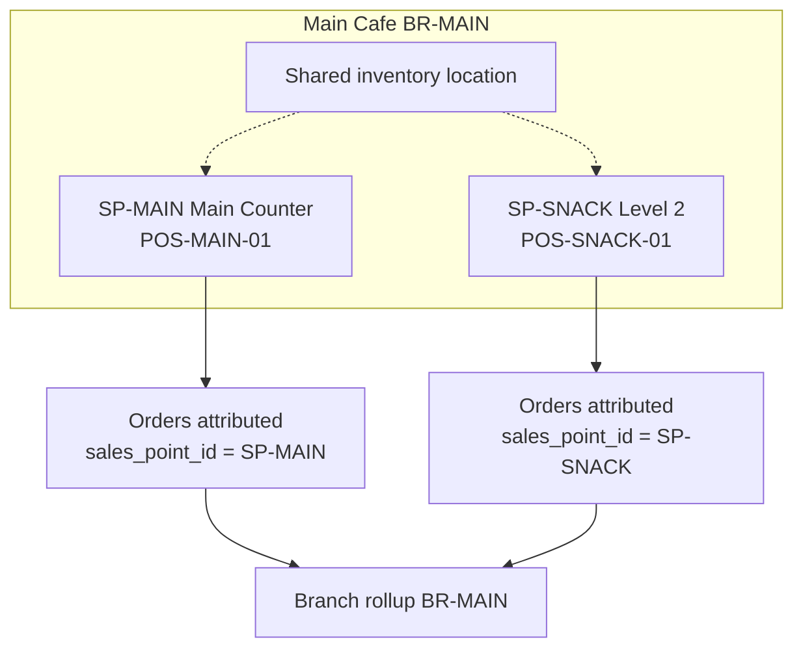

# Aida Cafe — Operations Workflow

Detailed flows for implemented Phase 1A–3A behaviour.  
**Planned** steps are labelled explicitly and must not be treated as live.

Companion: [TEAMMATE_HANDOVER.md](./TEAMMATE_HANDOVER.md)

---

## 1. Terminal enrolment

**Implemented.**

| Step | Status |
|------|--------|
| Manager issues OTC | Implemented |
| Device exchanges OTC for HttpOnly cookie | Implemented |
| Fingerprint alone authenticates | **Rejected** (telemetry only) |
| Device generates its own code | **Not allowed** |

---

## 2. Employee login and role routing

**Implemented** (React + API).

| Path | Status |
|------|--------|
| Cookie session + CSRF Origin | Implemented |
| Dual-role audited product select | Implemented |
| Legacy SPA `legacy-login` (feature flag) | Implemented (deprecated Phase 5) |
| Customer Bearer for employee routes | **Denied** |

---

## 3. Shift lifecycle

**Implemented.**

| Rule | Status |
|------|--------|
| Location from terminal only | Implemented |
| Client `branchId` spoof rejected | Implemented |
| One active shift per employee / terminal | Implemented |
| Sales require `status === open` | Implemented (Phase 3A) |
| Expected closing cash ≈ float + cash sales | Implemented (shift summary fields) |

---

## 4. Member / guest sale transaction

**API implemented** (`POST /api/v1/pos/sales`).  
**React cart/checkout UI: not implemented** (Phase 3B).

| Sale type | Behaviour | Status |
|-----------|-----------|--------|
| Member | Loyalty via shared `loyalty.js` | Implemented |
| Guest | `student_id` null; no loyalty | Implemented |
| Soft payment methods | Cash / Card / E-wallet / Student Wallet recorded | Implemented |
| Gateway settlement | — | **Planned / out of scope** |
| React checkout UI | — | **Planned Phase 3B** |

---

## 5. Loyalty, idempotency and audit (one transaction)

**Implemented** for POS sales path.

| Concern | Status |
|---------|--------|
| No partial order/loyalty/audit | Implemented |
| Concurrent same idempotency key → one order | Implemented |
| Order number via `order_number_seq` | Implemented |
| `audit_logs` UPDATE/DELETE blocked | Implemented |

---

## 6. Branch and Snack Station reporting

**Attribution implemented; rich Admin reporting UI planned.**

| Capability | Status |
|------------|--------|
| Sale stores `branch_id` + `sales_point_id` from terminal | Implemented |
| Snack Station filterable vs Main Counter | Data model ready |
| Consolidated Main Cafe reporting | Data model ready; Admin UI modules **planned** |
| Client-supplied location overrides | **Rejected** |

---

## Planned (not implemented)

| Area | Notes |
|------|--------|
| React POS cart / checkout | Call existing `/api/v1/pos/sales` |
| Void / refund with approval | New endpoints + audit |
| Payment gateway / terminal SDK | Soft POS recording only today |
| Offline queue | Fail closed; retry with same Idempotency-Key |
| Full Admin modules | Shells + placeholders only |
| Menu modifiers | Rejected until schema exists |

---

## Quick reference — key endpoints

| Flow | Method + path |
|------|----------------|
| Issue OTC | `POST /api/v1/terminals/:terminalId/enrolment-codes` |
| Enrol device | `POST /api/v1/terminals/enrol` |
| Terminal probe | `GET /api/v1/terminals/status` |
| Employee login | `POST /api/v1/auth/employee/login` |
| Product select | `POST /api/v1/auth/employee/product-select` |
| Open shift | `POST /api/v1/shifts/open` |
| POS sale | `POST /api/v1/pos/sales` |
| Lock / resume / close | `POST /api/v1/shifts/:id/lock\|resume\|close` |

Full schemas: [../openapi.yaml](../openapi.yaml).
