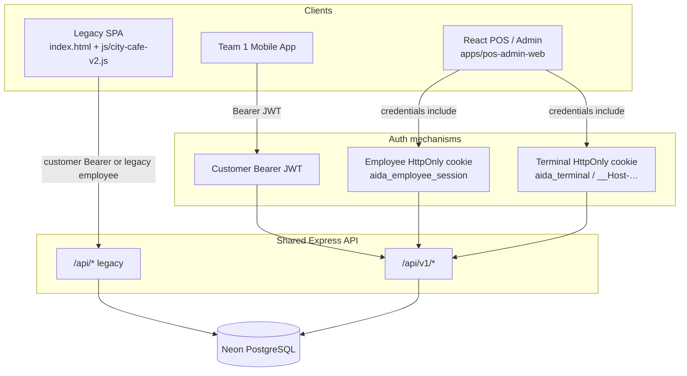

# Aida Cafe — Teammate Handover

**Audience:** Team 1 (Customer App) and Team 2 (POS / Admin) developers  
**Branch:** `feature/aida-cafe-production-rewire-phase3a`  
**Checkpoint:** Through Phase 3A (server-authoritative POS sales)  
**Related:** [OPERATIONS_WORKFLOW.md](./OPERATIONS_WORKFLOW.md) · [TEAM_INTEGRATION_CONTRACT.md](./TEAM_INTEGRATION_CONTRACT.md) · [../openapi.yaml](../openapi.yaml)

> Never commit `.env` files, Neon connection strings with credentials, JWT secrets, OTC codes, or terminal credentials.

---

## A. Project overview

**Aida Cafe Rewards** is a cafe loyalty and soft-POS platform:

- Members earn points/stamps, redeem rewards, and browse menu/offers.
- Staff record soft-POS sales (cash / card / e-wallet / student wallet as **recorded methods**, not gateway settlement).
- Managers administer locations, terminals, and (later) full Admin modules.

| Team | Owns |
|------|------|
| **Team 1** | Android / iOS customer application and customer-specific API integration |
| **Team 2** | Staff POS, Management Admin, branches/terminals/shifts, operational APIs |
| **Shared** | Single Express API + Neon PostgreSQL — **only** source of truth for members, menu, offers, loyalty, and orders |

Neither team may create a second loyalty engine or order store. Team 1 must not connect directly to production PostgreSQL.

---

## B. Current status

### Completed

| Phase | Scope |
|-------|--------|
| **0** | Planning docs, gap matrix, branch/sales-point model, migration plan |
| **1A** | React foundation (`apps/pos-admin-web`), `/api/v1`, OpenAPI, migrations `006`–`007`, authz helpers |
| **2A** | Employee cookie auth, badge/PIN, terminal OTC, shifts, audit logs (`008`–`011`) |
| **2B** | Employee welcome UI, role routing, shift UI, terminal HttpOnly cookie, legacy employee login gate, Playwright |
| **3A** | `POST /api/v1/pos/sales` — server-authoritative pricing, guest sales, idempotency, loyalty locking (`012`) |

### Not started

- React POS **cart / checkout UI** (Phase 3B)
- Full Admin module ports (members/menu/offers/analytics UIs beyond shells)
- Void / refund approval workflow
- Payment gateway / terminal SDK settlement
- Offline sale queue

### Pending

- **Team 1 contract review** of Phase 3A OpenAPI diff (`docs/PHASE_3A_OPENAPI_DIFF.md`)
- Shared **modifiers / variants** schema (modifier IDs currently rejected)

### Production status

**Untouched.** Do not migrate or deploy production Neon as part of local onboarding.

### Temporary Neon validation branch (no credentials)

| Field | Value |
|-------|--------|
| Branch name | `phase1a-validation-20260718` |
| Branch ID | `br-muddy-truth-aotvi2pm` |
| Host (sanitised) | `ep-polished-wildflower-aoqhtu9r.c-2.ap-southeast-1.aws.neon.tech` |
| Database name | `neondb` |
| Parent production host (forbidden for validation writes) | `ep-billowing-bread-aoyvj5iu.c-2.ap-southeast-1.aws.neon.tech` |

Connection strings and API keys stay in local `.env` only — never in Git.

### Feature flags

| Flag | Default for production-like use | Notes |
|------|----------------------------------|--------|
| `ENABLE_POS_SALES` | **disabled** (`≠1`) | Must remain **off** outside the temporary validation environment until Team 1 approves |
| `ENABLE_LEGACY_EMPLOYEE_LOGIN` | disabled | Dual-run for legacy SPA only; remove Phase 5 |

---

## C. Architecture



**Auth separation (critical):**

- **Customer:** `Authorization: Bearer <jwt>` from `POST /api/v1/auth/login` — never used for employee POS sales.
- **Employee:** HttpOnly session cookie from `POST /api/v1/auth/employee/login` (+ CSRF Origin on mutations).
- **Terminal:** Persistent HttpOnly cookie from `POST /api/v1/terminals/enrol` — JS never reads the secret; probe via `GET /api/v1/terminals/status`.

---

## D. Repository map

| Path | Purpose |
|------|---------|
| `apps/pos-admin-web/` | Vite + React + TypeScript POS/Admin app (shells, employee welcome, shifts UI; **no checkout cart yet**) |
| `production/api/` | Express API (`src/index.js`), scripts, tests |
| `production/api/src/routes/` | Legacy `/api/*` handlers (auth, menu, members, orders, …) |
| `production/api/src/routes/v1/` | Versioned employee + catalog surface (`employee-auth`, `terminals`, `shifts`, `pos-sales`) |
| `production/api/src/services/` | Business logic (loyalty, offers, money, terminals, shifts, pos-sales, audit) |
| `production/api/src/middleware/` | Auth, CSRF, employee session, terminal cookie, rate limits, open-shift |
| `production/api/src/authz/` | Role / product / branch permission helpers |
| `production/database/` | SQL schema + ordered migrations |
| `production/database/006`–`012_*.sql` | Branches/terminals → seeds → credentials → terminal enh. → shifts → audit → POS sales |
| `openapi.yaml` | OpenAPI 3.1.2 contract (Team 1 + Team 2) |
| `docs/` | Phase validation, contracts, this handover |
| `index.html` + `js/city-cafe-v2.js` | Legacy merchant demo SPA (still served by API) |
| `assets/` | Brand assets |

---

## E. Database model

```text
Branch (BR-MAIN / Main Cafe)
  └── Sales Point (SP-MAIN Main Counter | SP-SNACK Snack Station L2)
        └── Terminal (POS-MAIN-01 | POS-SNACK-01)
              └── Shift (open → locked → closed)
                    └── Order (+ order_items price snapshots)
```

- **Inventory:** both sales points share the Main Cafe inventory location (seeded in `007`).
- **Employees:** `users` + `staff_credentials` + `employee_sessions` (cookie token hash).
- **Terminals:** OTC enrolment codes → credential **hash** on `terminals`; browser holds HttpOnly cookie.
- **Audit:** `audit_logs` append-only (UPDATE/DELETE blocked by trigger).
- **Orders:** server-authoritative amounts; attribution (`staff_user_id`, `branch_id`, `sales_point_id`, `terminal_id`, `shift_id`) never from client.
- **Guest vs member:** guest → `student_id` NULL, `is_guest=true`, no loyalty mutation; member → loyalty via existing `loyalty.js` path under `FOR UPDATE`.
- **Idempotency:** unique `(staff_user_id, terminal_id, idempotency_key)` + payload hash.

---

## F. Security model

| Control | Behaviour |
|---------|-----------|
| Customer JWT | Bearer; employees rejected (`EMPLOYEE_LOGIN_REQUIRED` when password valid) |
| Employee session | HttpOnly cookie; idle + absolute expiry; revoke on logout |
| Terminal identity | HttpOnly cookie; hash server-side; fingerprint telemetry only |
| CSRF | Origin/Referer check on mutating employee cookie routes |
| Authz | Role + `selectedProduct` + `user_branch_access`; empty branch list ≠ global |
| Global manager | Explicit `is_global_manager` flag on admin |
| Shift | Open shift required for POS sales; locked/closed denied |
| Payments | Soft recording only — **no** PAN / CVV / track data |
| Secrets | Never in GitHub; use `.env` locally / host env in deploy |
| Team 1 DB | No direct production PostgreSQL access |

---

## G. Current API

Authoritative schemas: **[openapi.yaml](../openapi.yaml)**.

| Group | Examples |
|-------|----------|
| Customer auth | `POST /api/v1/auth/login`, `register`, `GET /api/v1/auth/me` |
| Employee auth | `POST /api/v1/auth/employee/login`, `login/badge`, `session`, `logout`, `product-select`, deprecated `legacy-login` |
| Terminals | `POST …/enrolment-codes`, `POST /enrol`, `GET /status`, `GET /current`, `heartbeat`, `revoke` |
| Shifts | `open`, `current`, `lock`, `resume`, `close`, `summary` |
| POS sales | `POST /api/v1/pos/sales` (`ENABLE_POS_SALES=1`) |
| Shared domains | menu, members, students, scan, offers, orders (legacy sales/redeem), analytics |

Compatibility note: Team 1 shapes for customer login/menu/offers/order history remain frozen. See `docs/PHASE_3A_OPENAPI_DIFF.md`.

---

## H. Development workflow

**Prerequisites:** Node.js ≥ 20, Git, disposable PostgreSQL (local Docker or authorised Neon **temp** branch).

```powershell
# 1. Clone and checkout active feature branch
git clone https://github.com/momenkhairalla-BIT/city-cafe-rewards.git
cd city-cafe-rewards
git checkout feature/aida-cafe-production-rewire-phase3a
git pull

# 2. API dependencies + env
cd production/api
npm install
copy .env.example .env
# Edit .env — local/disposable DATABASE_URL + JWT_SECRET only
# Leave ENABLE_POS_SALES unset unless using temp validation DB

# 3. Migrations — LOCAL / DISPOSABLE ONLY
# Base schema (first time):
npm run setup-db
npm run migrate-v2
npm run migrate-v3
npm run migrate-v4
npm run migrate-v5
npm run migrate-v6
npm run migrate-v7
# Phase 2A–3A on authorised TEMP Neon only (host-gated scripts):
# $env:ALLOW_DISPOSABLE_MIGRATE="1"
# $env:DISPOSABLE_DATABASE_URL="<temp-branch-url-not-committed>"
# npm run migrate:phase2a:temp
# npm run migrate:phase3a:temp
npm run hash-passwords

# 4. Start API (default http://localhost:3011 or PORT)
$env:PORT="3011"
npm run dev

# 5. React app (separate terminal)
cd ../../apps/pos-admin-web
npm install
# Optional: $env:VITE_API_PROXY="http://localhost:3011"
npm run dev
# Open http://localhost:5173/employee

# 6. Tests (API running where integration suites require it)
cd ../../production/api
npm run test:authz
npm run test:money
npm run openapi:lint
# Integration (set TEST_BASE_URL to your API):
# $env:TEST_BASE_URL="http://localhost:3011"
npm run test:phase2a
npm run test:terminal-cookie
npm run test:legacy-employee
npm run test:v1-security
npm run test:phase5
# Phase 3A needs ENABLE_POS_SALES=1 on the API process
npm run test:phase3a

cd ../../apps/pos-admin-web
npm run typecheck
npm test
npm run build
npm run test:e2e:install   # once
# $env:E2E_API_URL="http://localhost:3011"
npm run test:e2e
```

Legacy SPA UI: with API up, open `http://localhost:3011/` (serves `index.html`).

---

## I. Testing status (latest verified on temp branch)

| Suite | Result |
|-------|--------|
| `test:authz` | **14/14** |
| `test:phase2a` | **24/24** |
| `test:terminal-cookie` | **7/7** |
| `test:dual-role` | **4/4** |
| `test:legacy-employee` | **7/7** |
| `test:v1-security` | **10/10** |
| `test:phase5` | **12/12** |
| `test:phase3a` (+ money) | **26/26** |
| React unit tests | **19/19** |
| Playwright E2E | **9/9** |
| OpenAPI lint | **Pass** |
| React typecheck + production build | **Pass** |

Evidence: `docs/PHASE_2A_VALIDATION.md`, `PHASE_2B_VALIDATION.md`, `PHASE_3A_VALIDATION.md`.

---

## J. Operational workflow (implemented)

1. **Terminal enrolment** — manager OTC → device `POST /api/v1/terminals/enrol` → HttpOnly terminal cookie  
2. **Employee login** — password or badge/PIN → HttpOnly employee session  
3. **Role detection** — staff → POS; admin → Admin; dual-role → explicit product select  
4. **Location** — resolved from terminal cookie only (branch / sales point / terminal)  
5. **Shift open** — required before POS sales  
6. **POS session** — React shift controls (open/lock/resume/close); **checkout UI not implemented**  
7. **Sale** — `POST /api/v1/pos/sales` with `Idempotency-Key` (API/clients; React cart later)  
8. **Idempotent order** — same key+payload replays; different payload → 409  
9. **Loyalty + audit** — same DB transaction; guest skips loyalty  
10. **Shift lock / resume / close** — cash expected = float + cash sales totals  
11. **Admin** — separate product; no POS controls in Admin shell  

Detail diagrams: [OPERATIONS_WORKFLOW.md](./OPERATIONS_WORKFLOW.md).

---

## K. Contribution rules

1. Never commit work directly on `main`  
2. `git pull` before starting  
3. Descriptive feature branches (`feature/…`)  
4. Open a pull request for review  
5. **One migration authority** — additive SQL only; next free number after `012`  
6. Update `openapi.yaml` + Team contract for API changes  
7. Run relevant tests before push  
8. Never force-push shared branches  
9. Never commit `.env` / credentials / connection strings with passwords  
10. Do not enable production feature flags (`ENABLE_POS_SALES`, etc.) without approval  

---

## L. Immediate next steps

1. Team 1 approval of `PHASE_3A_OPENAPI_DIFF.md`  
2. Shared variants / modifiers foundation  
3. **Phase 3B** — React POS cart + checkout calling `/api/v1/pos/sales`  
4. Void / refund request + approval flow  
5. Admin feature migration (beyond shells)  
6. Production UAT and deployment (later — not now)  

---

## Quick links

| Doc | Path |
|-----|------|
| Operations flows | [OPERATIONS_WORKFLOW.md](./OPERATIONS_WORKFLOW.md) |
| Team contract | [TEAM_INTEGRATION_CONTRACT.md](./TEAM_INTEGRATION_CONTRACT.md) |
| OpenAPI | [../openapi.yaml](../openapi.yaml) |
| Phase 3A OpenAPI diff | [PHASE_3A_OPENAPI_DIFF.md](./PHASE_3A_OPENAPI_DIFF.md) |
| Phase validation | `PHASE_*_VALIDATION.md` |
| API env template | [../production/api/.env.example](../production/api/.env.example) |
